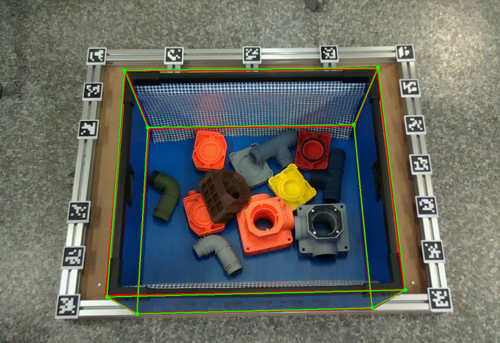

# Cuboid_detector

ROS 2 repository for 6D pose estimation of cuboid-like objects

1. [1. Setup](#1-setup)
   1. [Installation from Docker](#installation-from-docker)
   2. [Installation from Source](#installation-from-source)
2. [2. Commands for Demo](#2-commands-for-demo)
   1. [Evaluation Mode](#evaluation-mode)
   2. [Online Mode (ROS2 Topic)](#online-mode-ros2-topic)
3. [3. (Optional) How to save ros2 bag to data files](#3-optional-how-to-save-ros2-bag-to-data-files)


## 1. Setup

### Installation from Docker

```sh
docker build -t cuboid_detector:latest .
```

### Installation from Source

- The following setting is tested for Intel® RealSense™ LiDAR Camera <span style="color: red;">**L515**</span> with <span style="color: red;">**ROS 2 Humble**</span> in <span style="color: red;">**ubuntu 22.04**</span> only.
- Build the projects:

```shell
# librealsense를 먼저 설치

# https://github.com/IntelRealSense/realsense-ros?tab=readme-ov-file#installation-on-ubuntu

cd YOUR_ROS_WORKSPACE/src # Cuboid_detector 폴더 위치시키기

ros2_ws (YOUR_ROS_WORKSPACE)
├── build
├── install
├── log
└── src
    ├── Cuboid_detector
        ├── cuboid_detector
        │   ├── dataset
        │   │   ├── camera_info
        │   │   ├── data
        │   │   │   └── color_000000.png
        │   │   │   └── ...
        │   │   │   └── color_000009.png
        │   │   │   └── pose.json
        │   │   └── mesh
        │   │       └── danpla_box.obj
        │   │   └── ...
        │   ├── script
        │   │   ├── cuboid_detector.py      # Main detection script
        │   │   ├── gt_annotator.py         # Data annotation
        │   │   └── ...
        │   └── ...
        ├── README.md
        └── requirements.txt

sudo apt install ros-humble-vision-msgs ros-humble-realsense2-camera-msgs
cd Cuboid-detector && pip3 install -r requirements.txt
cd ../.. && colcon build
source install/local_setup.bash
```

## 2. Commands for Demo

### Evaluation Mode

(Offline test with saved PNG images)

<span style="color: red;"> **Basic:** </span>

```shell
cd YOUR_ROS_WORKSPACE/src/Cuboid_detector/cuboid_detector/script

python3 cuboid_detector.py --evaluate --visualize
```

<span style="color: red;"> **Docker:** </span>

```sh
# New container
xhost +
docker run -ti --net host -v /dev/shm:/dev/shm \
  -e DISPLAY=$DISPLAY --privileged -v /tmp/.X11-unix:/tmp/.X11-unix \
  cuboid_detector:latest \
  bash

# In the container
cd src/cuboid_detector/script
cuboid_detector cuboid_detector --evaluate --visualize
```

The evaluation results will show up like this:

- Green (thickness=2): Ground truth
- Red (thickness=4): Predicted bounding box



```text
# Error in box frame
Mean x error: 1.8691175989213542 mm
Mean y error: -0.6178012588862275 mm
Mean z error: -5.399375062604473 mm
Mean translation error: 6.131211014944094 mm
Mean rotation error: 0.6364534439764666 degrees
```

### Online Mode (ROS2 Topic)

(Real-time operation with L515 camera)

<span style="color: red;"> **Basic:** </span>

```shell
# L515 카메라 실행 또는 ros2 bag play YOUR_ROS_BAG_FILE_PATH
ros2 run cuboid_detector cuboid_detector
```

<span style="color: red;"> **Docker:** </span>

```sh
docker run -ti --net host -v /dev/shm:/dev/shm cuboid_detector:latest
```

Check the node status:

```shell
$ ros2 node info /cuboid_detector
/cuboid_detector
  Subscribers:
    /L515/color/camera_info: sensor_msgs/msg/CameraInfo
    /L515/color/image_raw: sensor_msgs/msg/Image
    /L515/depth/camera_info: sensor_msgs/msg/CameraInfo
    /L515/depth/image_rect_raw: sensor_msgs/msg/Image
    /L515/extrinsics/depth_to_color: realsense2_camera_msgs/msg/Extrinsics
  Publishers:
    /cuboid_detections: vision_msgs/msg/Detection3DArray
    /parameter_events: rcl_interfaces/msg/ParameterEvent
    /rosout: rcl_interfaces/msg/Log
  Service Servers:
    /cuboid_detector/describe_parameters: rcl_interfaces/srv/DescribeParameters
    /cuboid_detector/get_parameter_types: rcl_interfaces/srv/GetParameterTypes
    /cuboid_detector/get_parameters: rcl_interfaces/srv/GetParameters
    /cuboid_detector/list_parameters: rcl_interfaces/srv/ListParameters
    /cuboid_detector/set_parameters: rcl_interfaces/srv/SetParameters
    /cuboid_detector/set_parameters_atomically: rcl_interfaces/srv/SetParametersAtomically
  Service Clients:

  Action Servers:

  Action Clients:

```

## 3. (Optional) How to save ros2 bag to data files

```shell
cd YOUR_ROS_WORKSPACE/src/Cuboid_detector/cuboid_detector/script

python3 convert_topic_to_file.py
ros2 bag play YOUR_ROS_BAG_FILE_PATH
```
